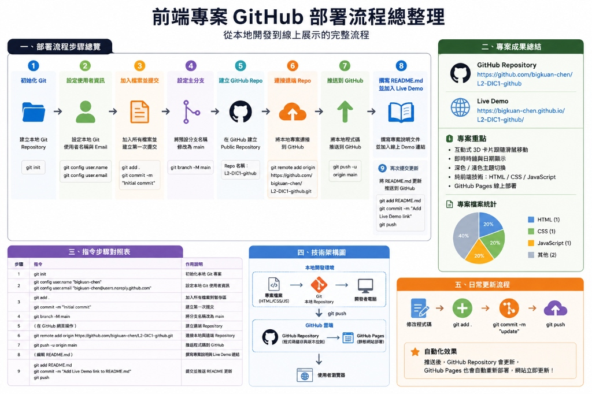

# 專案工作報告：L2-DIC1-github 專案上架與配置

本報告記錄了將本地專案 **[L2 DIC1=github](file:///d:/cena/L2%20DIC1=github)** 上傳至 GitHub 並進行完整配置的執行歷程與結果。

## 📊 專案基本資訊

| 欄位 | 說明 |
| :--- | :--- |
| **專案名稱** | L2-DIC1-github (互動式個人問候網頁) |
| **GitHub 帳戶** | [bigkuan-chen](https://github.com/bigkuan-chen) |
| **遠端儲存庫** | [L2-DIC1-github](https://github.com/bigkuan-chen/L2-DIC1-github) |
| **Live Demo** | [https://bigkuan-chen.github.io/L2-DIC1-github/](https://bigkuan-chen.github.io/L2-DIC1-github/) |
| **執行人員** | Antigravity AI |
| **產出時間** | 2026-05-29 |

---

## 🗺️ 部署流程圖解



---

## 🛠️ 工作執行大綱與進度

- [x] **步驟 1：環境與權限檢測** — 檢查 Git、GitHub CLI 以及 SSH 憑證狀態。
- [x] **步驟 2：初始化本地 Git 儲存庫** — 建立本地專案節點，配置本機使用者帳號與信箱。
- [x] **步驟 3：關聯遠端儲存庫並上傳** — 引導建立線上 Repository 並成功推送代碼。
- [x] **步驟 4：撰寫專案說明文檔 (README.md)** — 分析網頁代碼，設計專案特色、技術棧與使用手冊。
- [x] **步驟 5：配置 Live Demo** — 在說明文件中新增專案線上展示連結並更新至 GitHub。

---

## ⏱️ 詳細執行歷程紀錄

### 1. 環境稽核與決策制定
AI 逐步針對環境進行了完整檢查，以選擇最合適的連線與驗證方式：
1. **Git 狀態檢查**：確認本地工作目錄尚未初始化 Git 儲存庫。
2. **GitHub CLI (`gh`) 狀態**：未安裝 `gh` 工具。
3. **Git 全域/本地配置**：未設定使用者資訊（`user.name` 及 `user.email`）。
4. **SSH 密鑰稽核**：執行 `ssh -T git@github.com` 並檢查 `~\.ssh`，確認本機未配置 SSH 密鑰。
5. **憑證管理員與環境變數**：檢測到 Git 憑證管理員為 `manager` (HTTPS)，且未設定全域 `GITHUB_TOKEN`。
6. **方案決議**：與使用者達成共識，由使用者手動在 GitHub 上建立公開儲存庫，AI 負責在本地初始化 Git 並以 HTTPS 憑證推送。

### 2. 本地儲存庫初始化與首發提交
```bash
# 初始化 Git
git init

# 配置本地使用者資訊
git config user.name "bigkuan-chen"
git config user.email "bigkuan-chen@users.noreply.github.com"

# 暫存與提交 index.html，並將主分支更名為 main
git add .
git commit -m "Initial commit"
git branch -M main
```

### 3. 遠端儲存庫關聯與代碼推送
1. 新增遠端伺服器節點：
   ```bash
   git remote add origin https://github.com/bigkuan-chen/L2-DIC1-github.git
   ```
2. 引導使用者前往 GitHub 手動創建一個名為 **`L2-DIC1-github`** 的公開儲存庫（保持空白不初始化）。
3. 待使用者建妥後，成功將程式碼推送至遠端：
   ```bash
   git push -u origin main
   ```

### 4. 設計專案說明文件 (`README.md`)
AI 讀取並分析了 [index.html](file:///d:/cena/L2%20DIC1=github/index.html) 的內容，確認該專案為一個**兼具 3D 鼠標卡片懸停特效、自適應環境漸變光影效果、12小時制即時時鐘以及深淺色主題切換功能**的精緻個人問候網頁。

隨後在本地生成並寫入了豐富的 `README.md`，並執行推送：
```bash
git add README.md
git commit -m "Add README.md"
git push
```

### 5. 新增 Live Demo 網址與最後更新
根據使用者指示，在 `README.md` 描述中新增 GitHub Pages 的 Live Demo 連結，並更新至遠端：
```bash
git add README.md
git commit -m "Add Live Demo link to README.md"
git push
```

---

## 📦 最終交付成果

1. **本地端檔案**：
   - 原始網頁：[index.html](file:///d:/cena/L2%20DIC1=github/index.html)
   - 專案說明：[README.md](file:///d:/cena/L2%20DIC1=github/README.md)
   - 部署流程圖：[deployment_flow.jpg](file:///d:/cena/L2%20DIC1=github/deployment_flow.jpg)
   - 專案工作日誌：[工作日誌.md](file:///d:/cena/L2%20DIC1=github/工作日誌.md)
   - 本工作報告：[工作報告.md](file:///d:/cena/L2%20DIC1=github/工作報告.md)
2. **GitHub 遠端儲存庫**：[github.com/bigkuan-chen/L2-DIC1-github](https://github.com/bigkuan-chen/L2-DIC1-github)
3. **專案線上演示**：[bigkuan-chen.github.io/L2-DIC1-github/](https://bigkuan-chen.github.io/L2-DIC1-github/)
